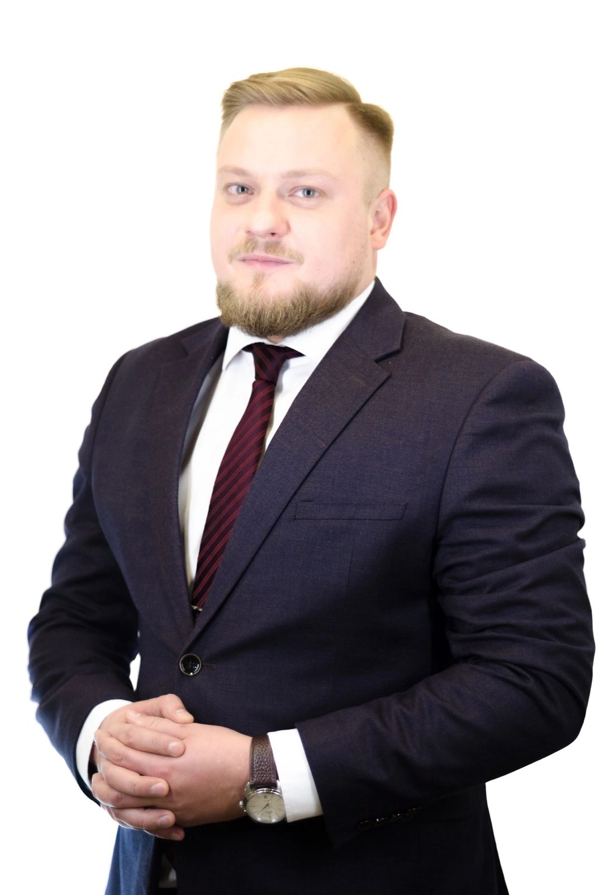

# Efimov George
## Junior Frontend Developer - Stage 0

| Efimov George (~229 lb) |    |
| ----- | -----|
| **Communication type** | **How to contact?** |
| **Phone:** | [+79208024445](tel:+79208024445) |
| **E-mail:** | efimovgeorge@icloud.com |
| **Discord:** | [efimovgeorge (@efimovgeorge)](https://discordapp.com/users/efimovgeorge#5086) |
| **GitHub** | https://github.com/efimovgeorge


My main goal is to be a good person.  
My strong point (working) is the left one (as in the photo).  
I sometimes do my own projects - I develop websites.  
Phew, Markdown has been added to my skills. Or not.  

***I even registered on codewars.com:***
```JavaScript
function multiply(a, b){
return  a * b
} 
```
Опыт работы. Junior Dev может перечислить учебные проекты с указанием использованных навыков и ссылками на исходный код.  
Образование (включая пройденные курсы и тренинги)  
Английский язык (уровень английского языка, если была языковая практика, расскажите о ней)  
